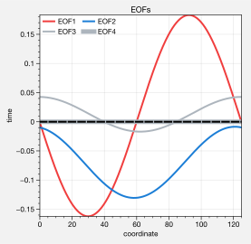
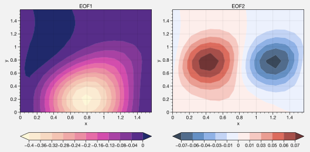

Empirical orthogonal functions
==============================

.. warning::

   These examples are out of date and may no longer work. Please refer
   first to the :ref:`API Reference` until the examples are updated.

1-dimensional EOFs
------------------

Use the `~climopy.oa.eof` function to calculate empirical orthogonal
functions and their associated eigenvalues and principle component
series. The below tests our function with an artifical “zonal-mean zonal
wind” dataset, generated with `~climopy.oa.rednoise`. The peak strength
and peak strength position vary in time (the *y*-axis). The PCs are
shown in the panel on the right.

.. code:: ipython3

    import climopy as climo
    import numpy as np
    import proplot as plot
    plot.nbsetup()
    def eofdata(nx, nt, alpha=0.95, scale1=1, scale2=1): # scales can be scalar, or space vectors
        # Get artificial EOF data. Note scale1/scale2 ***must be compatible shape***. You can make them 3D, singleton
        # 2-righthand dimensions, and that simulates creating another spatial dimension
        # Construct a see-saw of scale factors, varying from some number **smaller** than zero to **larger** than zero, and the 
        # **position** of the **center** of that see-saw (i.e. where factors equal 1) is a red noise time series.
        # Actually it didn't work and was dumb, nevermind
        # mid = climo.rednoise(nt, 0.95, mean=np.pi/4, stdev=np.pi/24)
        # data = data*(1 + ((x[:,None] - mid[None,:]))) # so the scaling looks more linear
        
        # Just impose a random *phase* and *amplitude*.
        x = np.linspace(0, np.pi/2, nx)
        t = np.linspace(0, nt/4, nt)
        # scale1, scale2 = np.atleast_1d(scale1), np.atleast_1d(scale2)
        phase = climo.rednoise(nt, alpha, mean=0, stdev=np.pi/12)
        amplitude = climo.rednoise(nt, alpha, mean=1, stdev=0.2)
        data = scale2*amplitude[None,:]*np.sin(scale1*phase[None,:] + (x*2)[:,None])**2 # big scale equals strong phase effect
        return x, t, data

.. code:: ipython3

    import numpy as np
    import climopy as climo
    import proplot as plot
    plot.nbsetup()
    # Coordinates
    # Note shape will be x by time
    t, x, data = eofdata(500, 500, alpha=0.98) # 500 x, 500 times
    
    # Next get the EOFs
    evals, nstar, projs, pcs = climo.eof(data, record=-1, space=[-2], neof=5)
    print('Data', data.shape)
    print('Evals', evals.shape, 'Nstar', nstar.shape, 'Projection', projs.shape, 'PCs', pcs.shape)
    
    # Plot data
    f, ax = plot.subplots(axwidth=4, bottomcolorbar=True, innerpanels='r', innerpanels_kw={'wwidth':1}, aspect=1.3)
    m = ax.contourf(x, t, data, cmap='sunset')
    ax.format(xlabel='coordinate', ylabel='time', title='Time series')
    res = f.bpanel.colorbar(m, clabel='magnitude')
    h1, = ax.rpanel.plot(pcs[0,0,:], t, color='pink5', label='EOF1')
    h2, = ax.rpanel.plot(pcs[1,0,:], t, color='yellow5', label='EOF2')
    ax.rpanel.legend([h1, h2], entire=False, ncols=1, frameon=True, framealpha=0.8)
    ax.rpanel.format(title='PC series')
    
    # And plot them
    f, ax = plot.subplots(axwidth=3)
    h1, = ax.plot(x, projs[0,:,0], color='red7', linewidth=2, label='EOF1')
    h2, = ax.plot(x, projs[1,:,0], color='blue7', linewidth=2, label='EOF2')
    h2, = ax.plot(x, projs[2,:,0], color='gray5', linewidth=2, label='EOF3')
    h3, = ax.plot(x, projs[3,:,0], color='gray5', linewidth=5, label='EOF4')
    ax.axhline(0, color='k', ls='--', lw=2)
    ax.format(xlabel='coordinate', ylabel='time', title='EOFs')
    l = ax.legend(ncols=2)

.. image:: quickstart/quickstart_13_1.svg

N-dimensional EOFs
------------------

Easily use `~climopy.oa.eof` to get an EOF along **arbitrary sample
dimensions** – for example, latitude, longitude, and pressure. The below
demonstrates this for an **artificial** zonal-mean zonal wind dataset
with a “baroclinic” mode and a “barotropic” mode.

.. code:: ipython3

    import numpy as np
    import climopy as climo
    import proplot as plot
    import scipy.stats as st
    plot.nbsetup()
    # New method, we just take the vector from above and tile it with varying scale factors
    # Let's say the position EOF is strong on top, and the strength EOF is strongest on the bottom
    nx, nt = 15, 100
    ny = 15
    # offset = 0 # will make lopsided scaling to one side
    m1, m2 = 1.5, -1.5
    scales1 = st.norm(m1, 1).pdf(np.linspace(-2, +2, ny)) # Gaussian curves
    scales2 = st.norm(m2, 1).pdf(np.linspace(-2, +2, ny))
    scales1 /= scales1.mean()
    scales2 /= scales2.mean()
    # scales1 = 2**(offset + np.linspace(-1, 1, ny)) # stronger on top
    # scales2 = 2**(-offset + np.linspace(-1, 1, ny))
    scales1 = scales1[:,None,None] # scale on an *extra dimension*
    scales2 = scales2[:,None,None]
    
    # Get data and scale it
    x, t, data = eofdata(nx, nt, scale1=scales1, scale2=scales2)
    y = x # the extra dimension; use same coordinates
    
    # Get the EOFs
    evals, nstar, projs, pcs = climo.eof(data, record=-1, space=(-3,-2), neof=5, debug=True)
    print('Data', data.shape)
    print('Evals', evals.shape, 'Nstar', nstar.shape, 'Projection', projs.shape, 'PCs', pcs.shape)
    f, axs = plot.subplots(innercolorbars='b', axwidth=3, ncols=2, span=0, share=0, wspace=0.5)
    nlev = 11
    data1 = projs[0,:,:,0].T
    data2 = projs[1,:,:,0].T 
    # data2 -= 10*projs[1,:,:,0].mean() # tests the 'zero' normalizer
    m1 = axs[0].contourf(x, y, data1, cmap='Sunset', levels=nlev, extend='both')
    m2 = axs[1].contourf(x, y, data2, cmap='NegPos', norm='zero', levels=nlev, extend='both')
    axs[0].format(title='EOF1')
    axs[1].format(title='EOF2')
    axs.format(xlabel='x', ylabel='y')
    res = axs[0].bottompanel.colorbar(m1)
    res = axs[1].bottompanel.colorbar(m2)

