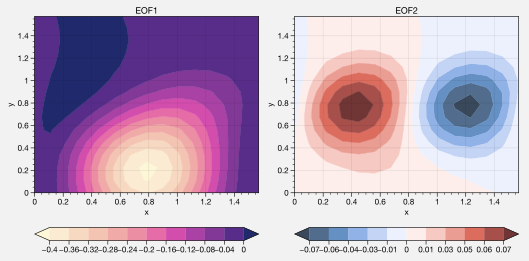
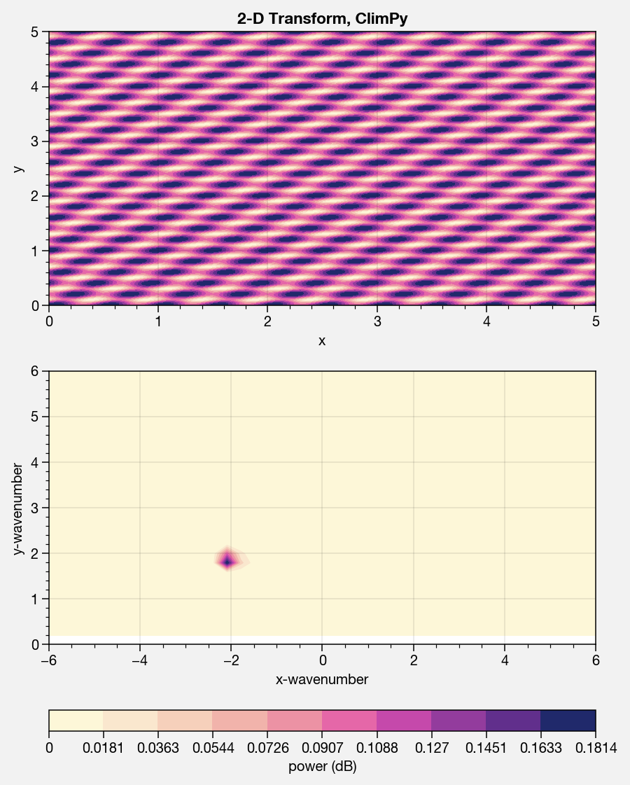

Data downloads
==============

Reanalysis downloads
--------------------

Easily download ERA-interim reanalysis data with the
`~climpy.downloads.eraint` function! Hoping to expand this to provide
tools for downloading MERRA reanalysis data, NCEP-NCAR reanalysis data,
and archived CMIP model data.

.. code:: ipython3

    # Load
    # NOTE: For now just get July and January values, store in same place
    # NOTE: Full decade is only 1GB or so, so we store one file
    import proplot as plot
    import climpy
    import numpy as np
    plot.nbsetup()
    levs = range(1,61) # all 60 of them, so we can interpolate easily
    hours = (0, 12) # only hours 0, 12 available; tdt is average over 12 ho
    urs it seems
    years = [(1981, 1990), (1991, 2000), (2001, 2010)]
    # For testing
    # levs = 58
    # hours = 12
    # years = [(2010, 2010)]
    for year in years:
        for month in (1,7):
            # Temperature tendency
            filename = f'{base}/mlevs/tdt_{year[0]:04d}-{year[1]:04d}_{month:02d}.grb2'
            print(f'\n\n\nTemperature tendency for years {year}, months {month}, file {filename}.')
            climpy.eraint(('tdt','msp'), 'oper', 'ml', levs=levs,
                    yearrange=year, months=month,
                    # days=1, # for testing
                    # years=year, month=months,
                    filename=filename, grid='F32',
                    forecast=True, format='grib2',
                    # forecast=True, format='netcdf',
                    step=12, hours=hours)

Time series analysis
====================

Trends and windows
------------------

Get the trend rate-of-change with the `~climpy.oa.linefit` function.
Get the actual best-fit line *y*-coordinates with using the ``build``
keyword arg.

.. code:: ipython3

    import proplot as plot
    import climpy
    import numpy as np
    plot.nbsetup()
    d = climpy.rednoise(500, 0.98, init=[-3,0,3], samples=3)
    # d = climpy.rednoise(500, 0.99, init=0, samples=[3,3])
    r = climpy.rolling(d, 50, axis=0, fillvalue=np.nan)
    s = climpy.linefit(d, axis=0, build=True)
    # fit = climpy.linefit(d, axis=0, stderr=True)
    # l = climpy.lanczos(30)
    f, ax = plot.subplots()
    for i in range(d.shape[1]):
        color = f'C{i}'
        h = ax.plot(d[:,i], color=color)
        h = ax.plot(r[:,i], color=color, alpha=.5, ls='--')
        h = ax.plot(s[:,i], color=color, alpha=.2, lw=2)
    ax.format(xlabel='x', ylabel='y', title='Red noise with window and line fit')

Lagged correlation
------------------

This is facilitated with the `~climpy.oa.covar`, and
`~climpy.oa.corr` functions. These functions also support
**autocorrelation** and **autocovariance**. An example is coming soon!

Empirical orthogonal functions
------------------------------

1D
~~

Use the `~climpy.oa.eof` function to calculate empirical orthogonal
functions and their associated eigenvalues and principle component
series. The below tests our function with an artifical “zonal-mean zonal
wind” dataset, generated with `~climpy.oa.rednoise`. The peak strength
and peak strength position vary in time (the *y*-axis). The PCs are
shown in the panel on the right.

.. code:: ipython3

    import climpy
    import numpy as np
    import proplot as plot
    plot.nbsetup()
    def eofdata(nx, nt, alpha=0.95, scale1=1, scale2=1): # scales can be scalar, or space vectors
        # Get artificial EOF data. Note scale1/scale2 ***must be compatible shape***. You can make them 3D, singleton
        # 2-righthand dimensions, and that simulates creating another spatial dimension
        # Construct a see-saw of scale factors, varying from some number **smaller** than zero to **larger** than zero, and the 
        # **position** of the **center** of that see-saw (i.e. where factors equal 1) is a red noise time series.
        # Actually it didn't work and was dumb, nevermind
        # mid = climpy.rednoise(nt, 0.95, mean=np.pi/4, stdev=np.pi/24)
        # data = data*(1 + ((x[:,None] - mid[None,:]))) # so the scaling looks more linear
        
        # Just impose a random *phase* and *amplitude*.
        x = np.linspace(0, np.pi/2, nx)
        t = np.linspace(0, nt/4, nt)
        # scale1, scale2 = np.atleast_1d(scale1), np.atleast_1d(scale2)
        phase = climpy.rednoise(nt, alpha, mean=0, stdev=np.pi/12)
        amplitude = climpy.rednoise(nt, alpha, mean=1, stdev=0.2)
        data = scale2*amplitude[None,:]*np.sin(scale1*phase[None,:] + (x*2)[:,None])**2 # big scale equals strong phase effect
        return x, t, data

.. code:: ipython3

    import numpy as np
    import climpy
    import proplot as plot
    plot.nbsetup()
    # Coordinates
    # Note shape will be x by time
    t, x, data = eofdata(500, 500, alpha=0.98) # 500 x, 500 times
    
    # Next get the EOFs
    evals, nstar, projs, pcs = climpy.eof(data, record=-1, space=[-2], neof=5)
    print('Data', data.shape)
    print('Evals', evals.shape, 'Nstar', nstar.shape, 'Projection', projs.shape, 'PCs', pcs.shape)
    
    # Plot data
    f, ax = plot.subplots(axwidth=4, bottomcolorbar=True, innerpanels='r', innerpanels_kw={'wwidth':1}, aspect=1.3)
    m = ax.contourf(x, t, data, cmap='sunset')
    ax.format(xlabel='coordinate', ylabel='time', title='Time series')
    res = f.bpanel.colorbar(m, clabel='magnitude')
    h1, = ax.rpanel.plot(pcs[0,0,:], t, color='pink5', label='EOF1')
    h2, = ax.rpanel.plot(pcs[1,0,:], t, color='yellow5', label='EOF2')
    ax.rpanel.legend([h1, h2], entire=False, ncols=1, frameon=True, framealpha=0.8)
    ax.rpanel.format(title='PC series')
    
    # And plot them
    f, ax = plot.subplots(axwidth=3)
    h1, = ax.plot(x, projs[0,:,0], color='red7', linewidth=2, label='EOF1')
    h2, = ax.plot(x, projs[1,:,0], color='blue7', linewidth=2, label='EOF2')
    h2, = ax.plot(x, projs[2,:,0], color='gray5', linewidth=2, label='EOF3')
    h3, = ax.plot(x, projs[3,:,0], color='gray5', linewidth=5, label='EOF4')
    ax.axhline(0, color='k', ls='--', lw=2)
    ax.format(xlabel='coordinate', ylabel='time', title='EOFs')
    l = ax.legend(ncols=2)

.. image:: showcase/showcase_13_1.svg

ND
~~

Easily use `~climpy.oa.eof` to get an EOF along **arbitrary sample
dimensions** – for example, latitude, longitude, and pressure. The below
demonstrates this for an **artificial** zonal-mean zonal wind dataset
with a “baroclinic” mode and a “barotropic” mode.

.. code:: ipython3

    import numpy as np
    import climpy
    import proplot as plot
    import scipy.stats as st
    plot.nbsetup()
    # New method, we just take the vector from above and tile it with varying scale factors
    # Let's say the position EOF is strong on top, and the strength EOF is strongest on the bottom
    nx, nt = 15, 100
    ny = 15
    # offset = 0 # will make lopsided scaling to one side
    m1, m2 = 1.5, -1.5
    scales1 = st.norm(m1, 1).pdf(np.linspace(-2, +2, ny)) # Gaussian curves
    scales2 = st.norm(m2, 1).pdf(np.linspace(-2, +2, ny))
    scales1 /= scales1.mean()
    scales2 /= scales2.mean()
    # scales1 = 2**(offset + np.linspace(-1, 1, ny)) # stronger on top
    # scales2 = 2**(-offset + np.linspace(-1, 1, ny))
    scales1 = scales1[:,None,None] # scale on an *extra dimension*
    scales2 = scales2[:,None,None]
    
    # Get data and scale it
    x, t, data = eofdata(nx, nt, scale1=scales1, scale2=scales2)
    y = x # the extra dimension; use same coordinates
    
    # Get the EOFs
    evals, nstar, projs, pcs = climpy.eof(data, record=-1, space=(-3,-2), neof=5, debug=True)
    print('Data', data.shape)
    print('Evals', evals.shape, 'Nstar', nstar.shape, 'Projection', projs.shape, 'PCs', pcs.shape)
    f, axs = plot.subplots(innercolorbars='b', axwidth=3, ncols=2, span=0, share=0, wspace=0.5)
    nlev = 11
    data1 = projs[0,:,:,0].T
    data2 = projs[1,:,:,0].T 
    # data2 -= 10*projs[1,:,:,0].mean() # tests the 'zero' normalizer
    m1 = axs[0].contourf(x, y, data1, cmap='Sunset', levels=nlev, extend='both')
    m2 = axs[1].contourf(x, y, data2, cmap='NegPos', norm='zero', levels=nlev, extend='both')
    axs[0].format(title='EOF1')
    axs[1].format(title='EOF2')
    axs.format(xlabel='x', ylabel='y')
    res = axs[0].bottompanel.colorbar(m1)
    res = axs[1].bottompanel.colorbar(m2)

Spectral analysis
=================

Spectral filtering
------------------

Use `~climpy.oa.filter` to filter data. Note this feature needs more
testing! But feel free to copy my code. The below shows response
functions and impulse response curves, and applies the filter to some
sample data.

.. code:: ipython3

    import proplot as plot
    import climpy
    import numpy as np
    plot.nbsetup()
    x = np.linspace(0,20,1000) # 20 days, but with tons of data in-between
    d = climpy.waves(x, wavelens=[1, 2])

.. code:: ipython3

    # Fake data
    n = 501
    wsample = 10
    cutoff = 1.2
    cutoff2 = 0.5
    waves = [0.3, 0.7, 2]
    x = np.linspace(0,wsample,n) # 20 days, but with tons of data in-between
    data = climpy.waves(x, np.array(waves), phase=None)
    # Iterate
    filters = ['lanczos', 'butterworth']
    # filters = ['butterworth', 'lanczos']
    # filters = ['butterworth']
    for filt in filters:
        # Create filters
        dx = x[1]-x[0]
        if filt=='lanczos':
            wfilter = 2
            w = climpy.lanczos(dx, wfilter, cutoff)
            w2 = climpy.lanczos(dx, wfilter, cutoff2)
            suptitle = f'{wfilter}-day Lanczos filter'
            # suptitle = f'{len(w[0])}-day Lanczos filter'
            # w, w2 = [w], [w2]
        elif filt=='butterworth':
            wfilter = 11 # should be odd-numbered
            w = climpy.butterworth(dx, wfilter, cutoff)
            w2 = climpy.butterworth(dx, wfilter, cutoff2)
            suptitle =  f'order-{len(w[1])} Butterworth filter'
        colors = ('red5', 'blue5')
        nf = 2 if filt=='butterworth' else 1 # in *this case*, for display purposes, need to prevent shifting to left or right
        # Preparation for drawing
        radians = False
        scale = 2*np.pi if radians else 1
        cutoffs = (cutoff,cutoff2)
        weights = (w,w2)
        # Draw stuff
        f, axs = plot.subplots(right=0.2, left=0.7, top=0.5, array=[[1],[0],[3],[4]], hratios=(1,-.25,1,1),
                               sharex=False, spany=False, hspace=.7, aspect=2)
        ax = axs[1]
        for ic,iw,color in zip(cutoffs,weights,colors):
            # s, r = climpy.lanczos(width, ic, dx, response=True)
            s, r = climpy.response(dx, *iw) # b and a coefficients, or maybe just b
            # print(s.max()), print(x.max())
            s = s*scale # optionally convert to radians
            r = r.copy()
            h = ax.plot(s, r, color=color, lw=2)
            ax.axvline(scale/ic, color='k', ls='--', lw=2, alpha=0.5) # the cutoff wavelenghs, converted to wavenumber
        xlim = [1e-1, 5]
        if not radians: # wavenumbers on x-axis
            xlocator = 1 # frequencies of interest
            xlabel = 'wavenumber (day$^{-1}$)'
            xformatter = None
        else: # frequency in radians on x-axis
            xlim[1] *= np.pi
            xlocator = plot.arange(0,np.pi*8,np.pi*0.5) # frequencies of interest
            xlabel = 'frequency (rad day$^{-1}$)'
            xformatter=plot.PiFormatter()
        ax.format(xscale='linear', xlim=xlim, xlocator=xlocator, xtickminor=False,
                  xformatter=xformatter, ylim=(-.1,1.1),
                  xlabel=xlabel, ylabel='Window coefficients') # frequency i.e. radians per time unit
        # xlocator = np.array([0.1, 0.5, 1, 5, 10])
        xlocator = np.array([0.1, 0.5, 1, 5])
        ax2 = ax.twinx()
        ax2.format(xscale='inverse', xlim=xlim,
                   xlabel='wavelength (day)', xlocator=xlocator, title='Response function',
                   xtickdir='in', # xticklabeldir='in',
                   xtickminor=True, xgrid=True, xgridminor=False)
        ax2.xaxis.grid(False, which='major')
        ax2.title.update({'position':(0.5,1.1)})
        for tick in ax2.xaxis.majorTicks:
            tick.gridline.set_visible(False)
        # Impulse response
        ax = axs[0]
        idata = data.copy()
        idata[:] = 0
        idata[0] = 1
        idata[len(idata)//2] = 1
        ifilter = climpy.filter(idata, *w, n=nf, axis=0, fix=False)
        ifilter2 = climpy.filter(idata, *w2, n=nf, axis=0, fix=False)
        ax.plot(x, idata, color='k', label='raw', alpha=0.8)
        ax.plot(x, ifilter, color=colors[0], alpha=0.8, ls='-', lw=2, label='lowpass 1')
        ax.plot(x, ifilter2, color=colors[1], alpha=0.8, ls='-', lw=2, label='lowpass 2')
        ax.legend()
        ylim = max(np.nanmax(np.abs(ifilter)), np.abs(np.nanmax(ifilter2)))*1.1
        ax.format(xlim=(0,x.max()), suptitle=suptitle,
                  xlabel='x (day)', ylabel='response', title='Impulse response', ylim=(-ylim, ylim))
        # Next play with sample data
        # Can show that, given some weights, lfilter does exact same thing as rolling() function
        # lanczos_roll = climpy.rolling(data, w, axis=0)
        # lanczos_roll2 = climpy.rolling(data, w2, axis=0)
        ax = axs[2]
        lfilter = climpy.filter(data, *w, n=nf, axis=0) # with builtin signal method
        lfilter2 = climpy.filter(data, *w2, n=nf, axis=0)
        ax.plot(x, data, color='gray5', label='raw', alpha=0.8)
        # ax.plot(x, lanczos_roll, color='r', alpha=1, ls='--', lw=2, label='Lanczos')
        # ax.plot(x, data-lanczos_roll2, color='orange', alpha=0.2, ls='-', lw=2, label='Lanczos')
        # ax.plot(x, lanczos_roll2-lanczos_roll, color='indigo5', alpha=1, ls='-', lw=2) # bandpass attempt
        ax.plot(x, lfilter, color='r', alpha=0.8, ls='-', lw=2, label='lowpass') # capture low-freq oscillation
        ax.plot(x, data - lfilter2, color='orange', alpha=0.2, ls='-', lw=2, label='highpass') # capture high-freq oscillation
        ax.plot(x, lfilter2 - lfilter, color='indigo5', alpha=0.8, ls='-', lw=2, label='bandpass') # capture middle oscillation
        ax.format(xlabel='x (day)', ylabel='y', title='Sample data',
                  # ylim=(-.01,.01), yformatter=plot.Formatter(precision=3),
                 )
        ax.legend(ncols=4)
        f.save(f'{filt}_display.pdf')

.. image:: showcase/showcase_20_1.png
   :width: 450px
   :height: 786px

1D power spectra
----------------

Use the `~climpy.oa.power` function to get the spectral power. You can
use the **exact same function** for getting the co-spectra, quadrature
spectra, and individual power spectra for two different time series! The
below tests its performance with an artificial dataset consisting of 3
sine curves, generated with `~climpy.oa.waves`.

.. code:: ipython3

    import proplot as plot
    import climpy
    import numpy as np
    plot.nbsetup()
    x = np.linspace(0,100,10000) # 20 days
    dx = x[1]-x[0]
    # Data
    # waves = [0.1, 0.2, 0.4, 0.6, 0.8, 3, 4, 5, 10, 30]
    waves = [0.5, 1, 4]
    window = len(x)//3 # 3 windows, or *5* overlapping windows
    data = climpy.waves(x, waves, phase=None)
    
    # Spectrum
    # freq, power = climpy.power(data, dx, wintype=('gaussian',2000))
    # freq, power = climpy.power(data, dx, wintype='boxcar', nperseg=2000)
    freq, power = climpy.power(data, dx=dx, cyclic=False, manual=True, wintype='hann', nperseg=2000, scaling='spectrum')
    freq = 1/freq # to wavelengths
    
    # Figure
    f, axs = plot.subplots(nrows=2, aspect=2, hspace=0.8, width=4, sharex=False, spany=False, hratios=(1,.5))
    ax = axs[0]
    ax.plot(x, data, label='raw')
    ax.format(xlabel='x', ylabel='y', suptitle='Power spectra')
    ax = axs[1]
    
    # Plot
    wnums = np.array([10, 0.3])
    ax.plot(freq, power, label='power spectrum')
    ax.format(xlim=1/wnums, xlabel='wavelength (days)', ylabel='strength')
    var = data.var()
    ax.text(-0.05, 1.5, f'total variance: {var:.1f}', va='top', weight='bold', transform='axes')
    ax = ax.twiny()
    ax.format(xlim=wnums[::-1], xscale='inverse', xlabel='wavenum (1/days)')
    # ax.format(xlabel='wavelength (days)', ylabel='power (dB)', xscale='log', ylim=(-100,0))

.. image:: showcase/showcase_23_1.svg

2D space-time power spectra
---------------------------

It’s also easy to get the “**2-dimensional**” spectral power, with one
cyclic and one temporal axis, as in `Randel and
Held <https://journals.ametsoc.org/doi/abs/10.1175/1520-0469(1991)048%3C0688:PSSOTE%3E2.0.CO%3B2>`__.
The below demonstrates this ability with an artificial wavetrain
propagating up the *y* axis with negative phase speed.

.. code:: ipython3

    # Data
    import proplot as plot
    import climpy
    import numpy as np
    plot.nbsetup()
    n2 = 1800
    n1 = int(n2*0.25)
    n1 = int(n2*0.5)
    nperseg = 600
    x1 = np.linspace(0,5,n1) # cyclic dim
    x2 = np.linspace(0,5,n2) # non-cyclic dims
    offset = np.linspace(0,1.5*np.pi,n2)[::-1]
    w1 = [2]
    w2 = [5]
    d1 = climpy.waves(x1[:,None] + offset[None,:], w1)
    d2 = climpy.waves(x2[None,:], w2) # changing phase as we go up
    dx1 = x1[1]-x1[0]
    dx2 = x2[1]-x2[0]
    data = d1 + d2

.. code:: ipython3

    # Note: -2 transform will be transform of *real* data (i.e. symmetric), so left-half taken, but -1 transform
    # will be transform of *complex* data, so both halves remain
    f1, f2, result = climpy.power2d(data, dx=dx1, dy=dx2, nperseg=nperseg, axes=(0,1))
    fig, axs = plot.subplots(nrows=2, aspect=2, width=5, sharex=False, spany=False, bottomcolorbar=True)
    # result = 10*np.log10(result)
    ax = axs[0]
    ax.contourf(x1, x2, data.T, cmap='sunset')
    ax.format(suptitle='2-D Transform, ClimPy', xlabel='x', ylabel='y')
    ax = axs[1]
    m = ax.contourf(f1, f2, result.T, cmap='sunset', levels=np.linspace(result.min(),result.max(),11))
    xl = 6
    ylim = (0, 6)
    ax.format(xlabel='x-wavenumber', ylabel='y-wavenumber', xlim=(-xl,xl), ylim=ylim)
    fig.bottompanel.colorbar(m, clabel='power (dB)')

