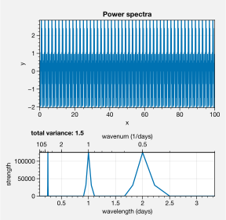

Spectral analysis
=================

.. warning::

   These examples are out of date and may no longer work. Please refer
   first to the :ref:`API Reference` until the examples are updated.

Spectral filtering
------------------

Use `~climopy.oa.filter` to filter data. Note this feature needs more
testing! But feel free to copy my code. The below shows response
functions and impulse response curves, and applies the filter to some
sample data.

.. code:: ipython3

    import proplot as plot
    import climopy as climo
    import numpy as np
    plot.nbsetup()
    x = np.linspace(0,20,1000) # 20 days, but with tons of data in-between
    d = climo.waves(x, wavelens=[1, 2])

.. code:: ipython3

    # Fake data
    n = 501
    wsample = 10
    cutoff = 1.2
    cutoff2 = 0.5
    waves = [0.3, 0.7, 2]
    x = np.linspace(0,wsample,n) # 20 days, but with tons of data in-between
    data = climo.waves(x, np.array(waves), phase=None)
    # Iterate
    filters = ['lanczos', 'butterworth']
    # filters = ['butterworth', 'lanczos']
    # filters = ['butterworth']
    for filt in filters:
        # Create filters
        dx = x[1]-x[0]
        if filt=='lanczos':
            wfilter = 2
            w = climo.lanczos(dx, wfilter, cutoff)
            w2 = climo.lanczos(dx, wfilter, cutoff2)
            suptitle = f'{wfilter}-day Lanczos filter'
            # suptitle = f'{len(w[0])}-day Lanczos filter'
            # w, w2 = [w], [w2]
        elif filt=='butterworth':
            wfilter = 11 # should be odd-numbered
            w = climo.butterworth(dx, wfilter, cutoff)
            w2 = climo.butterworth(dx, wfilter, cutoff2)
            suptitle =  f'order-{len(w[1])} Butterworth filter'
        colors = ('red5', 'blue5')
        nf = 2 if filt=='butterworth' else 1 # in *this case*, for display purposes, need to prevent shifting to left or right
        # Preparation for drawing
        radians = False
        scale = 2*np.pi if radians else 1
        cutoffs = (cutoff,cutoff2)
        weights = (w,w2)
        # Draw stuff
        f, axs = plot.subplots(right=0.2, left=0.7, top=0.5, array=[[1],[0],[3],[4]], hratios=(1,-.25,1,1),
                               sharex=False, spany=False, hspace=.7, aspect=2)
        ax = axs[1]
        for ic,iw,color in zip(cutoffs,weights,colors):
            # s, r = climo.lanczos(width, ic, dx, response=True)
            s, r = climo.response(dx, *iw) # b and a coefficients, or maybe just b
            # print(s.max()), print(x.max())
            s = s*scale # optionally convert to radians
            r = r.copy()
            h = ax.plot(s, r, color=color, lw=2)
            ax.axvline(scale/ic, color='k', ls='--', lw=2, alpha=0.5) # the cutoff wavelenghs, converted to wavenumber
        xlim = [1e-1, 5]
        if not radians: # wavenumbers on x-axis
            xlocator = 1 # frequencies of interest
            xlabel = 'wavenumber (day$^{-1}$)'
            xformatter = None
        else: # frequency in radians on x-axis
            xlim[1] *= np.pi
            xlocator = plot.arange(0,np.pi*8,np.pi*0.5) # frequencies of interest
            xlabel = 'frequency (rad day$^{-1}$)'
            xformatter=plot.PiFormatter()
        ax.format(xscale='linear', xlim=xlim, xlocator=xlocator, xtickminor=False,
                  xformatter=xformatter, ylim=(-.1,1.1),
                  xlabel=xlabel, ylabel='Window coefficients') # frequency i.e. radians per time unit
        # xlocator = np.array([0.1, 0.5, 1, 5, 10])
        xlocator = np.array([0.1, 0.5, 1, 5])
        ax2 = ax.twinx()
        ax2.format(xscale='inverse', xlim=xlim,
                   xlabel='wavelength (day)', xlocator=xlocator, title='Response function',
                   xtickdir='in', # xticklabeldir='in',
                   xtickminor=True, xgrid=True, xgridminor=False)
        ax2.xaxis.grid(False, which='major')
        ax2.title.update({'position':(0.5,1.1)})
        for tick in ax2.xaxis.majorTicks:
            tick.gridline.set_visible(False)
        # Impulse response
        ax = axs[0]
        idata = data.copy()
        idata[:] = 0
        idata[0] = 1
        idata[len(idata)//2] = 1
        ifilter = climo.filter(idata, *w, n=nf, axis=0, fix=False)
        ifilter2 = climo.filter(idata, *w2, n=nf, axis=0, fix=False)
        ax.plot(x, idata, color='k', label='raw', alpha=0.8)
        ax.plot(x, ifilter, color=colors[0], alpha=0.8, ls='-', lw=2, label='lowpass 1')
        ax.plot(x, ifilter2, color=colors[1], alpha=0.8, ls='-', lw=2, label='lowpass 2')
        ax.legend()
        ylim = max(np.nanmax(np.abs(ifilter)), np.abs(np.nanmax(ifilter2)))*1.1
        ax.format(xlim=(0,x.max()), suptitle=suptitle,
                  xlabel='x (day)', ylabel='response', title='Impulse response', ylim=(-ylim, ylim))
        # Next play with sample data
        # Can show that, given some weights, lfilter does exact same thing as rolling() function
        # lanczos_roll = climo.rolling(data, w, axis=0)
        # lanczos_roll2 = climo.rolling(data, w2, axis=0)
        ax = axs[2]
        lfilter = climo.filter(data, *w, n=nf, axis=0) # with builtin signal method
        lfilter2 = climo.filter(data, *w2, n=nf, axis=0)
        ax.plot(x, data, color='gray5', label='raw', alpha=0.8)
        # ax.plot(x, lanczos_roll, color='r', alpha=1, ls='--', lw=2, label='Lanczos')
        # ax.plot(x, data-lanczos_roll2, color='orange', alpha=0.2, ls='-', lw=2, label='Lanczos')
        # ax.plot(x, lanczos_roll2-lanczos_roll, color='indigo5', alpha=1, ls='-', lw=2) # bandpass attempt
        ax.plot(x, lfilter, color='r', alpha=0.8, ls='-', lw=2, label='lowpass') # capture low-freq oscillation
        ax.plot(x, data - lfilter2, color='orange', alpha=0.2, ls='-', lw=2, label='highpass') # capture high-freq oscillation
        ax.plot(x, lfilter2 - lfilter, color='indigo5', alpha=0.8, ls='-', lw=2, label='bandpass') # capture middle oscillation
        ax.format(xlabel='x (day)', ylabel='y', title='Sample data',
                  # ylim=(-.01,.01), yformatter=plot.Formatter(precision=3),
                 )
        ax.legend(ncols=4)
        f.save(f'{filt}_display.pdf')

.. image:: quickstart/quickstart_20_2.png
   :width: 450px
   :height: 786px

1D power spectra
----------------

Use the `~climopy.oa.power` function to get the spectral power. You can
use the **exact same function** for getting the co-spectra, quadrature
spectra, and individual power spectra for two different time series! The
below tests its performance with an artificial dataset consisting of 3
sine curves, generated with `~climopy.oa.waves`.

.. code:: ipython3

    import proplot as plot
    import climopy as climo
    import numpy as np
    plot.nbsetup()
    x = np.linspace(0,100,10000) # 20 days
    dx = x[1]-x[0]
    # Data
    # waves = [0.1, 0.2, 0.4, 0.6, 0.8, 3, 4, 5, 10, 30]
    waves = [0.5, 1, 4]
    window = len(x)//3 # 3 windows, or *5* overlapping windows
    data = climo.waves(x, waves, phase=None)
    
    # Spectrum
    # freq, power = climo.power(data, dx, wintype=('gaussian',2000))
    # freq, power = climo.power(data, dx, wintype='boxcar', nperseg=2000)
    freq, power = climo.power(data, dx=dx, cyclic=False, manual=True, wintype='hann', nperseg=2000, scaling='spectrum')
    freq = 1/freq # to wavelengths
    
    # Figure
    f, axs = plot.subplots(nrows=2, aspect=2, hspace=0.8, width=4, sharex=False, spany=False, hratios=(1,.5))
    ax = axs[0]
    ax.plot(x, data, label='raw')
    ax.format(xlabel='x', ylabel='y', suptitle='Power spectra')
    ax = axs[1]
    
    # Plot
    wnums = np.array([10, 0.3])
    ax.plot(freq, power, label='power spectrum')
    ax.format(xlim=1/wnums, xlabel='wavelength (days)', ylabel='strength')
    var = data.var()
    ax.text(-0.05, 1.5, f'total variance: {var:.1f}', va='top', weight='bold', transform='axes')
    ax = ax.twiny()
    ax.format(xlim=wnums[::-1], xscale='inverse', xlabel='wavenum (1/days)')
    # ax.format(xlabel='wavelength (days)', ylabel='power (dB)', xscale='log', ylim=(-100,0))

2D space-time power spectra
---------------------------

It’s also easy to get the “**2-dimensional**” spectral power, with one
cyclic and one temporal axis, as in `Randel and
Held <https://journals.ametsoc.org/doi/abs/10.1175/1520-0469(1991)048%3C0688:PSSOTE%3E2.0.CO%3B2>`__.
The below demonstrates this ability with an artificial wavetrain
propagating up the *y* axis with negative phase speed.

.. code:: ipython3

    # Data
    import proplot as plot
    import climopy as climo
    import numpy as np
    plot.nbsetup()
    n2 = 1800
    n1 = int(n2*0.25)
    n1 = int(n2*0.5)
    nperseg = 600
    x1 = np.linspace(0,5,n1) # cyclic dim
    x2 = np.linspace(0,5,n2) # non-cyclic dims
    offset = np.linspace(0,1.5*np.pi,n2)[::-1]
    w1 = [2]
    w2 = [5]
    d1 = climo.waves(x1[:,None] + offset[None,:], w1)
    d2 = climo.waves(x2[None,:], w2) # changing phase as we go up
    dx1 = x1[1]-x1[0]
    dx2 = x2[1]-x2[0]
    data = d1 + d2

.. code:: ipython3

    # Note: -2 transform will be transform of *real* data (i.e. symmetric), so left-half taken, but -1 transform
    # will be transform of *complex* data, so both halves remain
    f1, f2, result = climo.power2d(data, dx=dx1, dy=dx2, nperseg=nperseg, axes=(0,1))
    fig, axs = plot.subplots(nrows=2, aspect=2, width=5, sharex=False, spany=False, bottomcolorbar=True)
    # result = 10*np.log10(result)
    ax = axs[0]
    ax.contourf(x1, x2, data.T, cmap='sunset')
    ax.format(suptitle='2-D Transform, ClimPy', xlabel='x', ylabel='y')
    ax = axs[1]
    m = ax.contourf(f1, f2, result.T, cmap='sunset', levels=np.linspace(result.min(),result.max(),11))
    xl = 6
    ylim = (0, 6)
    ax.format(xlabel='x-wavenumber', ylabel='y-wavenumber', xlim=(-xl,xl), ylim=ylim)
    fig.bottompanel.colorbar(m, clabel='power (dB)')

.. image:: quickstart/quickstart_27_3.png
   :width: 450px
   :height: 560px

