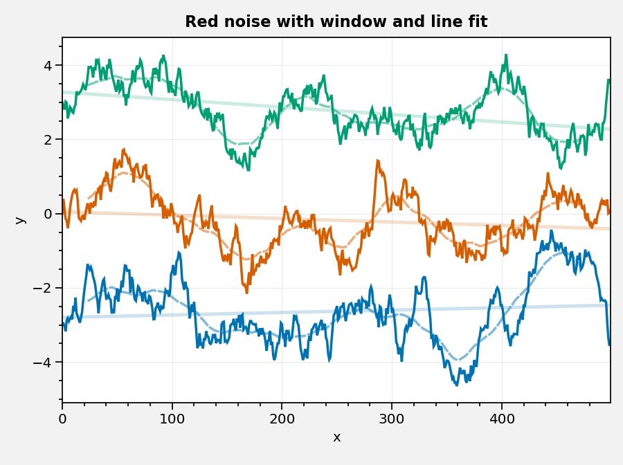

Time series analysis
====================

.. warning::

   These examples are out of date and may no longer work. Please refer
   first to the :ref:`API Reference` until the examples are updated.

Trends and windows
------------------

Get the trend rate-of-change with the `~climopy.oa.linefit` function.
Get the actual best-fit line *y*-coordinates with using the ``build``
keyword arg.

.. code:: ipython3

    import proplot as plot
    import climopy as climo
    import numpy as np
    plot.nbsetup()
    d = climo.rednoise(500, 0.98, init=[-3,0,3], samples=3)
    # d = climo.rednoise(500, 0.99, init=0, samples=[3,3])
    r = climo.rolling(d, 50, axis=0, fillvalue=np.nan)
    s = climo.linefit(d, axis=0, build=True)
    # fit = climo.linefit(d, axis=0, stderr=True)
    # l = climo.lanczos(30)
    f, ax = plot.subplots()
    for i in range(d.shape[1]):
        color = f'C{i}'
        h = ax.plot(d[:,i], color=color)
        h = ax.plot(r[:,i], color=color, alpha=.5, ls='--')
        h = ax.plot(s[:,i], color=color, alpha=.2, lw=2)
    ax.format(xlabel='x', ylabel='y', title='Red noise with window and line fit')

Lagged correlation
------------------

This is facilitated with the `~climopy.oa.covar`, and
`~climopy.oa.corr` functions. These functions also support
**autocorrelation** and **autocovariance**. An example is coming soon!

